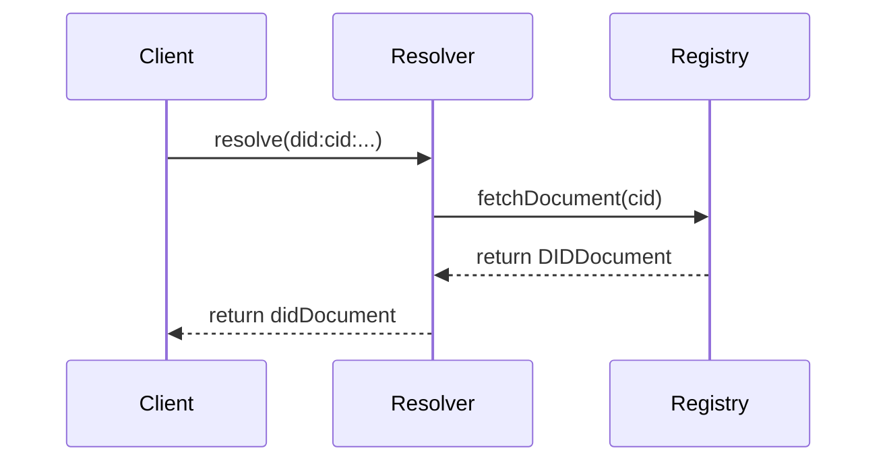

# The did:cid Method Specification

The `did:cid` method leverages Content Identifier (CID) logic to create permanent, resolvable identifiers.

## Definition
A `did:cid` identifier follows the format: `did:cid:<cid-string>`.

[[def: CID]]:
~ A Content Identifier is a self-describing method of referencing data in a content-addressed system like IPFS.

### Resolution Flow
The resolution of a `did:cid` follows a specific path to retrieve the DID Document from a registry.

::: example
**Example Resolution:**
1. Client requests `did:cid:bagaa...`
2. Resolver queries the Archon Registry.
3. Registry returns the signed DID Document.
:::

## Lifecycle
- **Creation:** Generated locally via a keypair, then anchored to a registry.
- **Resolution:** Pulled from the distributed registry using the CID.
- **Update:** Occurs via a versioned update process, ensuring the latest DID Document is anchored.
