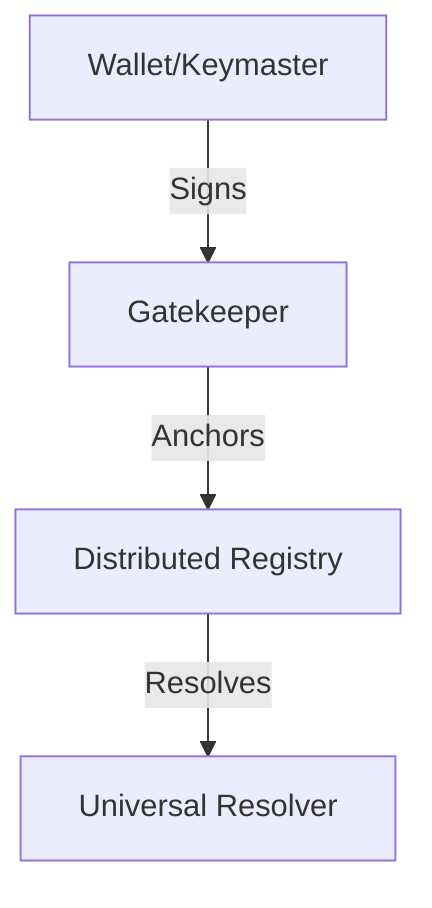

# System Architecture

Archon is composed of three primary layers: the Wallet, the Gatekeeper, and the Registry.

## Components

### The Wallet (Keymaster)
The wallet manages the private keys and the logic for signing operations. It is the root of trust for the user.

### The Gatekeeper
The Gatekeeper acts as the secure API layer, managing requests and coordinating between the wallet and the registry.

### The Registry
The Registry is the distributed ledger where DID Documents are anchored.

::: summary Architecture Logic
The separation of these layers allows for varying levels of custody (Self-custodial vs. Managed) while maintaining the same identity standard.
:::

