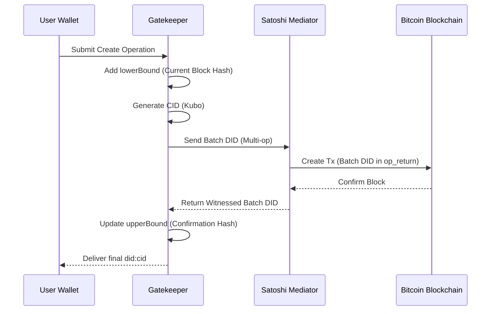

# Cryptographic Framework & Blockchain Anchoring

Archon implements a "Verify-then-Compute" model. The blockchain does not store the identity itself, but rather the **deterministic proof of the sequence of operations** that lead to the current state of a DID.

## 1. Identity Generation (The Local Root)

The journey of an Archon identity begins locally, ensuring that private keys never leave the user's control.

[[def: HD Key]]:
~ A Hierarchical Deterministic key derived from a seed, allowing the generation of multiple keys from a single root.

**The Generation Chain:**
`BIP32 Seed` $
ightarrow$ `Wallet HD Key` $
ightarrow$ `DID Keys` $
ightarrow$ `Create Operation`

::: note
All key generation and signature operations occur within the local Wallet/Keymaster context.
:::

## 2. The Anchoring Process (The Create Cycle)

Anchoring transforms a local identity into a globally verifiable one by creating a "Temporal Proof" on a public ledger (e.g., Bitcoin).

### The Temporal Bound Mechanism
Archon uses a dual-bound system to prove the existence of a document at a specific point in time:

*   **Lower Bound:** The Gatekeeper identifies the current Bitcoin block hash at the time of creation and embeds it in the `didDocumentMetadata`. This proves the identity **did not exist** prior to this block.
*   **Upper Bound:** The `upperBound` is added once the `Batch DID` is witnessed in a confirmed block's `op_return` field, proving the identity **is anchored** as of that block.

### The Mediator Loop
The interaction between the Gatekeeper and the Blockchain is handled via the **Satoshi Mediator**.

## 3. Resolution via Deterministic Reconstruction

Unlike traditional DID methods that store a document in a database, **the resolved DID Document does not exist as a static entity in the system.**

### The Reconstruction Logic
When a resolver requests a DID, the Gatekeeper performs a **Deterministic Replay**:
1.  **Fetch Anchor:** Locate the initial anchor on the registry.
2.  **Sequence Operations:** Pull all validated update operations in chronological order.
3.  **Apply State Changes:** Apply each operation (key rotations, metadata updates, registry changes) to the base document.
4.  **Finalize:** Attach `didResolutionMetadata` and return the resulting Document.

::: summary Zero-State Storage
The blockchain contains the *proof of the sequence*. The Gatekeeper provides the *compute* to reconstruct the state. This ensures that if a Gatekeeper is compromised, the identity can be reconstructed by any other trusted node using the same blockchain evidence.
:::

## 4. Advanced Operations

### Key Rotation
A valid `update` operation can be used to rotate the `verificationMethod` of a DID. Because this operation is anchored, the rotation is cryptographically proven and immutable.

### Registry Migration
Archon allows the identity to "hop" registries. An `update` operation can change the underlying network (e.g., moving from Bitcoin to another supported registry) while maintaining the same `did:cid`.
