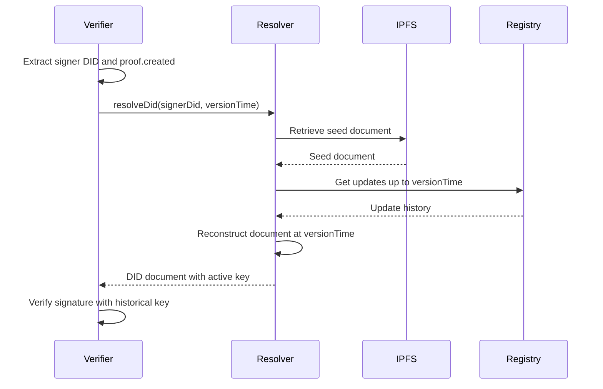

## Proof Verification

[[def: temporal resolution, Resolving a DID at a specific point in time to retrieve the key state that was active when a proof was created]]

When verifying a proof on a credential or other signed object, the verifier must resolve the signer's DID **at the time the proof was created**. This is essential for supporting key rotation — credentials signed with an old key must remain verifiable even after the signer rotates to a new key.

The `proof.created` timestamp serves two purposes:

1. Records when the proof was made (audit trail).
1. Anchors verification to the correct historical key state.

### Verification Algorithm

```
function verifyProof(object):
    extract signerDid from proof.verificationMethod
    resolve signerDid at versionTime = proof.created
    get publicKey from resolved DID document
    verify signature using publicKey
    return valid or invalid
```

This [[ref: temporal resolution]] ensures that a credential issued in 2020 can still be verified in 2030, even if the issuer has rotated keys multiple times since issuance.

::: note
While the W3C Data Integrity specification makes `proof.created` optional, `did:cid` **requires** it to support proper verification after key rotation.
:::

### Verification Method Format

The `proof.verificationMethod` field identifies which key was used to create the proof. The format depends on the operation type:

| Operation | `verificationMethod` Format | Example |
|-----------|---------------------------|---------|
| Agent create | Relative reference `#key-1` (DID doesn't exist yet, proof is self-referential) | `#key-1` |
| Asset create | Full DID reference of the controller | `did:cid:abc123#key-1` |
| Update / Delete | Full DID reference of the controller | `did:cid:abc123#key-N` |

