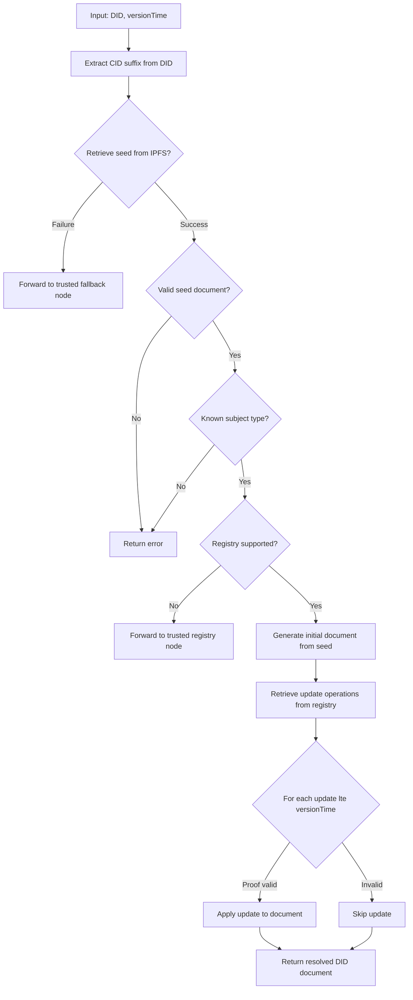

## DID Resolution

[[def: resolution, The process of dereferencing a DID to obtain its current (or historical) DID document and metadata]]

Resolution is the operation of responding to a DID with a DID Document. If you think of the DID as a secure reference or pointer, then resolution is equivalent to dereferencing.

Given a DID and an optional resolution time, the resolver retrieves the associated [[ref: seed document]] from IPFS using the DID suffix as the CID, parsing it as plaintext JSON.

### Resolution Options

The `did:cid` method supports the following resolution options per [[ref: DID-CORE]]:

| Option | Type | Description |
|--------|------|-------------|
| `versionTime` | ISO 8601 datetime | Resolve the DID document as it existed at or before this point in time |
| `versionSequence` | integer | Resolve at a specific operation sequence number (1-indexed from creation) |
| `versionId` | CID string | Resolve at the operation identified by this specific CID |

If no option is specified, the resolver returns the most recent confirmed version.

::: note
`versionId` accepts the CID of any operation in the DID's [[ref: operation chain]], enabling pinpoint resolution at any historical state. This is the most precise resolution mode — `versionTime` and `versionSequence` both reduce to a `versionId` lookup internally once the target operation is identified.
:::

---

### Resolution Algorithm



### Pseudocode

```
function resolveDid(did, versionTime=now):
    get suffix from did
    use suffix as CID to retrieve seed document from IPFS
    if fail to retrieve the seed document:
        forward request to a trusted node
        return
    look up did's registry in its seed document
    if did's registry is not supported by this node:
        forward request to a trusted node
        return
    generate initial document from seed
    retrieve all update operations from did's registry
    for all updates until versionTime:
        if proof is valid and update is valid:
            apply update to DID document
    return DID document
```

### Fallback and Forwarding

If a node cannot fulfill a resolution request — either because the seed document is unreachable on IPFS or because the DID's specified registry is not supported — the node must forward the request to a trusted node. The forwarding chain is:

1. **Registry not supported** → forward to a trusted node that monitors the specified registry.
1. **No trusted node for registry** → forward to a general-purpose fallback node.
1. **IPFS seed unreachable** → forward to a node with broader IPFS connectivity.

### Ordinal Key Ordering

Update records from the registry are ordered by an [[def: ordinal key, A tuple of values used to sort update operations into chronological order, specific to the registry type — e.g., `{block index, transaction index, batch index}` for BTC]]. This ensures deterministic resolution regardless of node synchronization timing.