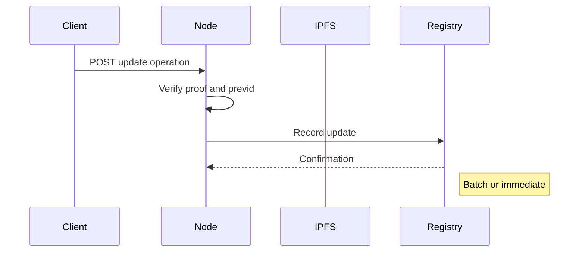

## DID Update

[[def: update operation, A signed operation that modifies the DID document associated with an existing DID, recorded on the DID's registry]]

A DID Update is a change to any of the documents associated with the DID. To initiate an update, the client must sign an operation that includes the following fields:

| Field | Required | Description |
|-------|----------|-------------|
| `type` | Yes | Must be `"update"` |
| `did` | Yes | The DID being updated |
| `doc` | Yes | The new version of the document set (may include any of `didDocument`, `didDocumentData`, `didDocumentRegistration`) |
| `previd` | Yes | The CID of the previous operation (collision-prevention hash link) |
| `blockid` | No | Current block ID on registry (if blockchain) |

### Update Flow

1. Create an update operation object with the fields above.
1. Sign the JSON with the private key of the controller of the DID.
1. Submit the operation to a node (e.g., `POST /api/v1/did/`).

::: note
It is recommended that the client fetches the current version of the document and metadata, makes changes to it, then submits the new version in an update operation in order to preserve fields that should not change.
:::

### Key Rotation Example

```json
{
    "type": "update",
    "did": "did:cid:bagaaieradidcs4hohalzexldr5mdmbmt553tqq3ifqd56mvhifppvyfdc32q",
    "previd": "bagaaieradidcs4hohalzexldr5mdmbmt553tqq3ifqd56mvhifppvyfdc32q",
    "doc": {
        "didDocument": {
            "@context": [
                "https://www.w3.org/ns/did/v1"
            ],
            "id": "did:cid:bagaaieradidcs4hohalzexldr5mdmbmt553tqq3ifqd56mvhifppvyfdc32q",
            "verificationMethod": [
                {
                    "id": "#key-2",
                    "controller": "did:cid:bagaaieradidcs4hohalzexldr5mdmbmt553tqq3ifqd56mvhifppvyfdc32q",
                    "type": "EcdsaSecp256k1VerificationKey2019",
                    "publicKeyJwk": {
                        "kty": "EC",
                        "crv": "secp256k1",
                        "x": "hrpjLquejw7lOE2RVGr1LQ315k0JI1lwlI4WI3t983k",
                        "y": "G2_-Agy95QnIFzW5sa9Ik72vDPeqJ0rqqrxWs3CM49o"
                    }
                }
            ],
            "authentication": [
                "#key-2"
            ],
            "assertionMethod": [
                "#key-2"
            ]
        }
    },
    "proof": {
        "type": "EcdsaSecp256k1Signature2019",
        "created": "2026-01-14T19:29:16.117Z",
        "verificationMethod": "did:cid:bagaaieradidcs4hohalzexldr5mdmbmt553tqq3ifqd56mvhifppvyfdc32q#key-1",
        "proofPurpose": "authentication",
        "proofValue": "LEmM9NGL3b4WBzSUZVy0GOqzZ16KbGydBWfCwRNTmZV-ZRznm9g_09xIszITyB3y2A3DYYYaRp5E_tFegZgBgQ"
    }
}
```

Upon receiving the operation, the node must:

1. Verify the proof is valid for the controller of the DID.
1. Verify the `previd` is identical to the latest version's operation CID.
1. Record the operation on the DID's specified registry (or forward the request to a trusted node that supports the specified registry).

### Batch vs. Immediate Registration

For registries such as BTC with non-trivial transaction costs, update operations will be placed in a queue and registered periodically in a batch in order to balance costs and latency. If the registry has trivial transaction costs, the update operation may be distributed individually and immediately. This method defers this tradeoff between cost, speed, and security to the node operators.

